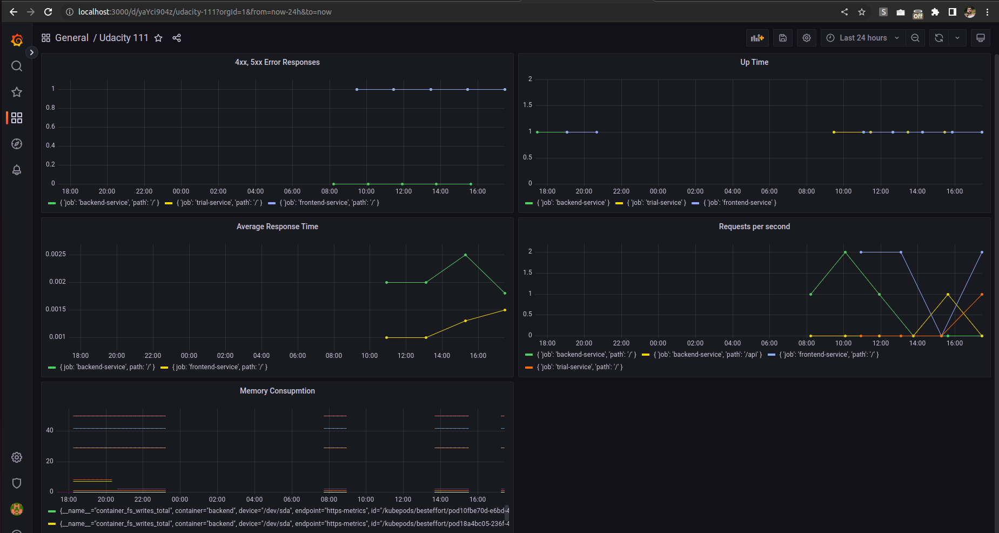

**Note:** For the screenshots, you can store all of your answer images in the `answer-img` directory.

## Verify the monitoring installation

*DONE:* run `kubectl` command to show the running pods and services for all components. Take a screenshot of the output and include it here to verify the installation

## Setup the Jaeger and Prometheus source
*DONE:* Expose Grafana to the internet and then setup Prometheus as a data source. Provide a screenshot of the home page after logging into Grafana.

## Create a Basic Dashboard
*DONE:* Create a dashboard in Grafana that shows Prometheus as a source. Take a screenshot and include it here.

## Describe SLO/SLI
SLOs are the objective in technical terms that an engineering team sets for themselves in order to provide a certain level of service quality to the customer. In other words, it is the goal that team is setting for themselves. In this example, "monthly uptime" is the goal that team is setting for themselves. They need to discuss internally according to agreements with the customer and come up with a realistic number like 99% uptime. Same goes for "request response time", the team needs to decide on a realistic and achieveable number for the request-respones time.

SLIs are the actual measurements of the SLOs. For example, in case of uptime, team decided to have an uptime of 99%. This is our SLO. But now the team is measuring the actual uptime over the whole month and they final number for the uptime might come up to be 99.3%. This is our SLI. The same goes for request-response time. The team needs to measure request-response time over the whole month, take average and that would then be the SLI.

## Creating SLI metrics.
1. Percentage of 4xx and 5xx responses: We want to count how many of the requests actually end up in error responses. This metric will count that.
2. Monthly uptime: this is the measure of how much uptime the website had within the whole month.
3. Average response time: This metric measures the average response time from the server.
4. Maximum memory usage of each service: This metric will help us figure out if any of the services are about to reach the max. memory and might cause an outage.
5. Maximum cpu usage for each service: This metric will help us measure the cpu usage of each service. If a service is using too much cpu, it might result in outage of services.

## Create a Dashboard to measure our SLIs

## Tracing our Flask App

## Jaeger in Dashboards

## Report Error

TROUBLE TICKET

Name: Kashif Ilyas

Date: 08.02.2023

Subject: Errors in Backend services

Affected Area: Backed Trial Services

Severity: High

Description:
Dear Developer, we have recently come to notice that some of the backend services are frequently throwing 500 codes. The service particularly noted for this is called "backed trial service" and is deployed as "trial service".

Please let me know if you need more details.

## Creating SLIs and SLOs
SLO: 99.5% uptime per month
SLIs:
1. Memory Consumption
2. CPU Consumption
3. Requests per second
4. Average response time

## Building KPIs for our plan
1. Memory Consumption: One big reason of service outage is when a service suddenly requires more memory than available. Monitoring the memory can help us spot such possible issues.
   1. KPIs:
      1. Max memory consumption of backend service
      2. Average memory consumption of backend service
      3. Max memory consumption of frontend service
      4. Average memory consumption of frontend service
2. CPU Usage: One big reason of service outage is when a service suddenly requires more CPU than available. By monitoring cpu usage, we can spot such instances.
   1. KPIs:
      1. Max CPU consumption of backend service
      2. Average CPU consumption of backend service
      3. Max CPU consumption of frontend service
      4. Average CPU consumption of frontend service
3. Requests per second: The load on our services in terms of how many requests we are getting per second can indicate if our services can get overloaded and cause a service outage.
   1. KPIs:
      1. Average requests per second for frontend service
      2. Average requests per second for backedn service
4. Average response time: If requests are taking too long to be responded, that also indicates that our services are overloaded and we will probably see a service downgrade and some of the upcoming requests will timeout. Hence, it is important to keep an eye on this indicator.
   1. KPIs:
      1. Average response time for backend services
      2. Average response time for frontend servies

## Final Dashboard

Explanation:
1. 5xx Error Responses: The graph shows number of 5xx i.e. error responses for both backend and frontend services
2. Requests per second: The graph shows number of requests per second for frontend, backend and trial service.
3. Average response time: The graph shows the average response time for each of the services.
4. Uptime: The graph shows the uptime of each container on the cluster.
5. Memory consumption: The graph shows the memory consumption of each service.
