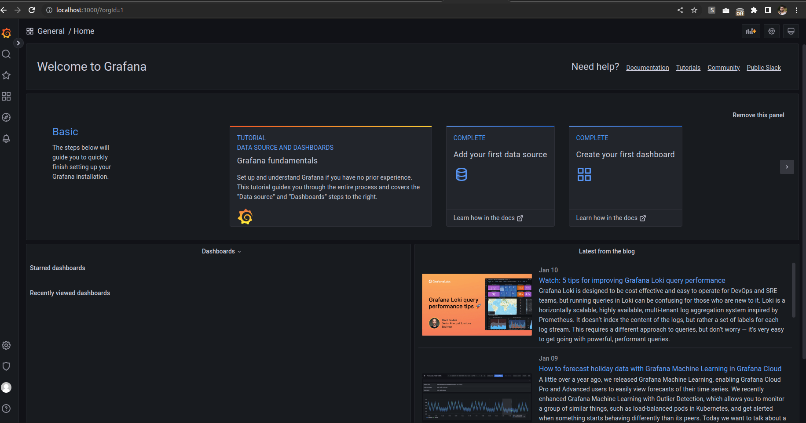

**Note:** For the screenshots, you can store all of your answer images in the `answer-img` directory.

## Verify the monitoring installation

*DONE:* run `kubectl` command to show the running pods and services for all components. Take a screenshot of the output and include it here to verify the installation

## Setup the Jaeger and Prometheus source
*DONE:* Expose Grafana to the internet and then setup Prometheus as a data source. Provide a screenshot of the home page after logging into Grafana.

## Create a Basic Dashboard
*DONE:* Create a dashboard in Grafana that shows Prometheus as a source. Take a screenshot and include it here.

## Describe SLO/SLI
SLOs are the objective in technical terms that an engineering team sets for themselves in order to provide a certain level of service quality to the customer. In other words, it is the goal that team is setting for themselves. In this example, "monthly uptime" is the goal that team is setting for themselves. They need to discuss internally according to agreements with the customer and come up with a realistic number like 99% uptime. Same goes for "request response time", the team needs to decide on a realistic and achieveable number for the request-respones time.

SLIs are the actual measurements of the SLOs. For example, in case of uptime, team decided to have an uptime of 99%. This is our SLO. But now the team is measuring the actual uptime over the whole month and they final number for the uptime might come up to be 99.3%. This is our SLI. The same goes for request-response time. The team needs to measure request-response time over the whole month, take average and that would then be the SLI.

## Creating SLI metrics.
1. Percentage of 4xx and 5xx responses: We want to count how many of the requests actually end up in error responses. This metric will count that.
2. Monthly uptime: this is the measure of how much uptime the website had within the whole month.
3. Average response time: This metric measures the average response time from the server.
4. Maximum memory usage of each service: This metric will help us figure out if any of the services are about to reach the max. memory and might cause an outage.
5. Maximum cpu usage for each service: This metric will help us measure the cpu usage of each service. If a service is using too much cpu, it might result in outage of services.

## Create a Dashboard to measure our SLIs
I tried my best to find ways to show a graph for uptime. I have gone through the course content now two times and desprately searched the internet to find how to measure uptime of an applicaiton using Prometheus. It has costed me ~20 hours this week and has severyly affected my job. I am cancelling my subscription. please help me or fail me.

## Tracing our Flask App
The screenshot of updated code is here. However it does not show up in Jaeger UI no matter what I try. Below are screenshots of updated code, updated Dockerfile, updated deployment yaml and the logs of the updated deployment. I am trying my best to get it done. Please help.

## Jaeger in Dashboards
Again, I can create a dashboard in Grafana to fetch the traces from Jaeger but somehow the traced from "backend" app are just not there. I am attaching the screenshot of pulling traces for "simplest" app,

## Report Error

TROUBLE TICKET

Name: Kashif Ilyas

Date: 08.02.2023

Subject: Errors in Backend services

Affected Area: Backed Trial Services

Severity: High

Description:
Dear Developer, we have recently come to notice that some of the backend services are frequently throwing 500 codes. The service particularly noted for this is called "backed trial service" and is deployed as "trial service".

Please let me know if you need more details.

## Creating SLIs and SLOs
1. Up time of the all  backend services measured per month
2. Memory consumption
3. CPU usage
4. Failed requests 5xx responses

## Building KPIs for our plan
1. CPU Usage: One big reason of service outage is when a service suddenly requires more CPU than available. By monitoring cpu usage, we can spot such instances.
2. Memory Usage: Similar to above, higher than available memory usage can also cause service outage. Monitoring the memory can help us spot such possible issues.

## Final Dashboard

